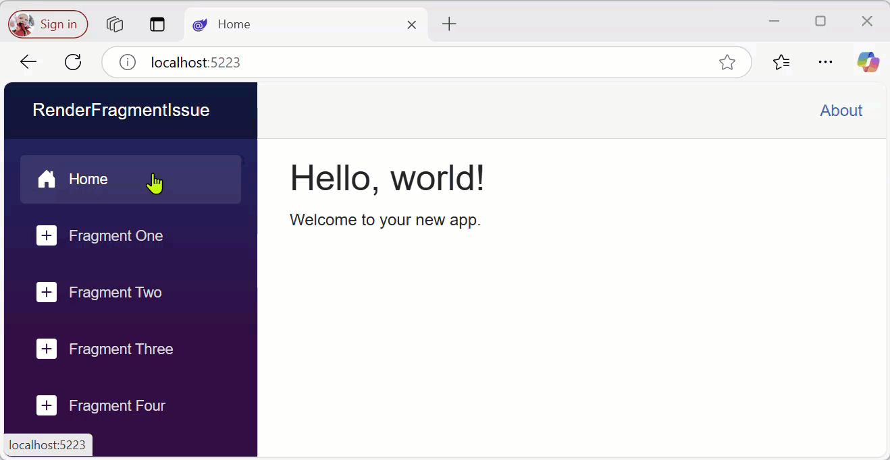

# blazor-renderfragment-issue

> [!NOTE]
> RenderFragment not able to switch content in Interactive Mode. 
> Using any of the `@rendermode Interactive*` makes the rendering "stop". 
> Removing the `@rendermode`-line, everything is rendered as expected, but no interaction (button clicks etc) is possible.



## Example

* `RenderFragmentPageOneAndTwo.razor` combines two routes. Only the first route hit is rendered as expected.

Location of these files: `Source\RenderFragmentIssue\RenderFragmentIssue.Client\Pages`

```csharp
// Combining two routes in one page
@page "/renderfragment/one"
@page "/renderfragment/two"
```

Would expect to show contents of the given `RenderFragment` based on the route.

* `RenderFragmentPageThree.razor` shows only one renderfragment, and it seems to be render correctly.
* `RenderFragmentPageFour.razor` shows only one renderfragment, and it seems to be render correctly.